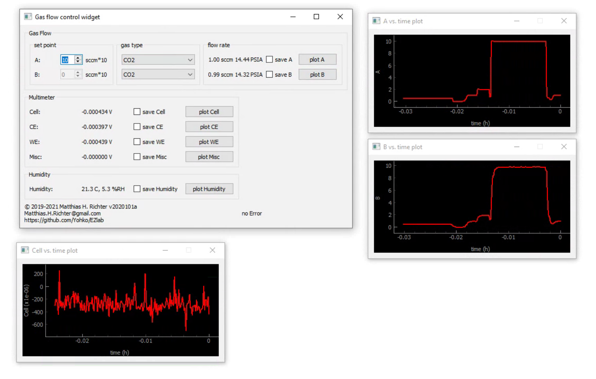

# EZlab
simple instrument control with a dynamic GUI




### Supported Instruments
- Keithley 2000 Digital Multimeter
- Keithley 2100 Digital Multimeter
- Keithley 2182A Nanovoltmeter
- Newport 69931 Digital Radiometric Power Supply (Xenon Lamp)
- Newport 68945 Digital Exposure Control
- SRS PTC10 Programmable Temperature Controller
- Alicat mass flow controllers and mass flow meters
- Omega RH-USB temperature/humidity sensor
- Thorlabs SC10 Optical Beam Shutter Controller
- Lambda SC SmartShutter
  
### Prerequisites

```
pip install PyQT5 pyqtgraph pyserial pyvisa-py
```
  
  
### Authors
- Matthias Richter matthias.h.richter@gmail.com
